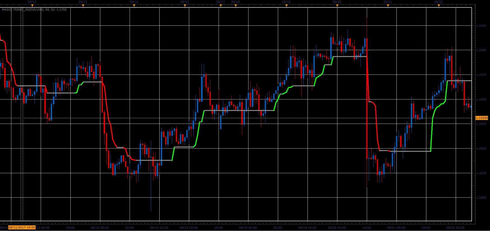

# Magic Trend indicator

> Source: https://fxcodebase.com/code/viewtopic.php?f=48&t=65232  
> Forum: 48 · Topic 65232 · 1 post(s)

---

## Magic Trend indicator

**Alexander.Gettinger** · Sat Oct 28, 2017 9:39 am

IF CCI >= 0 MAGIC = max(previous MAGIC, LOW - ATR()), else MAGIC = min(previous MAGIC, HIGH + ATR()).

 

Download:

 [Magic Trend_JS.jsl](files/115656/Magic%20Trend_JS.jsl)
