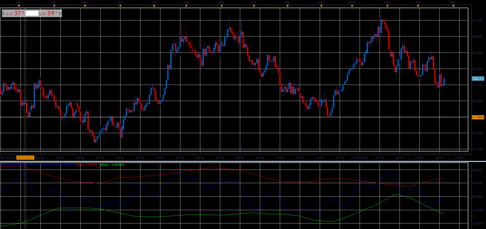

# Market Mode (MM)

> Source: https://fxcodebase.com/code/viewtopic.php?f=48&t=66053  
> Forum: 48 · Topic 66053 · 1 post(s)

---

## Market Mode (MM)

**Alexander.Gettinger** · Wed May 02, 2018 11:54 am

This indicator is used to determine whether the market is in a trending or a cyclical mode.

 

Download:

 [MM_JS.jsl](files/119005/MM_JS.jsl)
