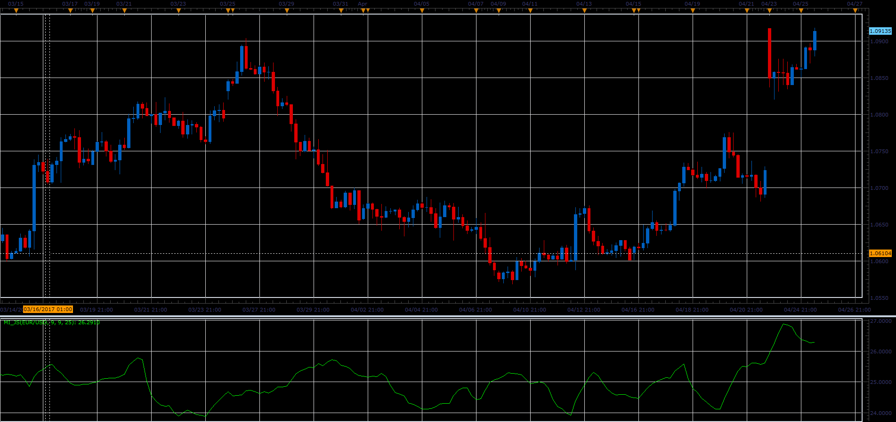

# Mass Index

> Source: https://fxcodebase.com/code/viewtopic.php?f=48&t=64729  
> Forum: 48 · Topic 64729 · 1 post(s)

---

## Mass Index

**Alexander.Gettinger** · Fri Jun 02, 2017 2:15 pm

The mass index serves for finding turns in trends. It is based on changes between maximum and minimum prices. If the amplitude gets wider, the mass index grows; if it gets narrower, the index gets smaller.

Calculation:

MI = SUM (EMA (HIGH - LOW, 9) / EMA (EMA (HIGH - LOW, 9), 9), N)

Where:
SUM — means a sum;
HIGH — the maximum price of the current bar;
LOW — the minimum price of the current bar;
EMA — the exponential moving average;
N — the period of the indicator (the number of values added).

 

Download:

 [MI_JS.jsl](files/112718/MI_JS.jsl)
