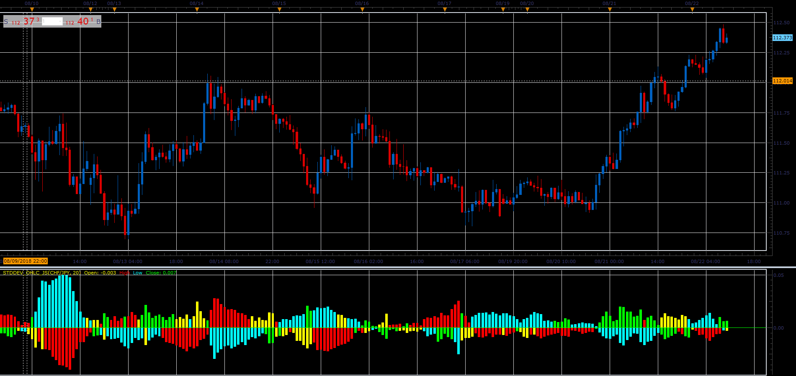

# Max&Min standard deviation

> Source: https://fxcodebase.com/code/viewtopic.php?f=48&t=66993  
> Forum: 48 · Topic 66993 · 1 post(s)

---

## Max&Min standard deviation

**Alexander.Gettinger** · Sat Nov 24, 2018 5:25 pm

The indicator compares the values ​​of standard deviation (StdDev), calculated for the open, close, high and low prices and displays the minimum and maximum values​​.

 

Download:

 [StdDev_OHLC_JS.jsl](files/122322/StdDev_OHLC_JS.jsl)
