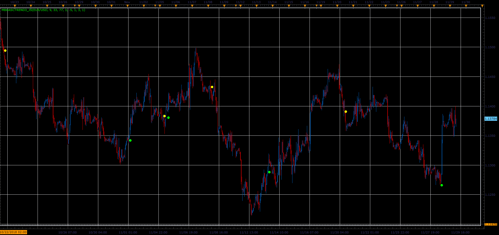

# MBKAsctrend3 indicator

> Source: https://fxcodebase.com/code/viewtopic.php?f=48&t=67096  
> Forum: 48 · Topic 67096 · 1 post(s)

---

## MBKAsctrend3 indicator

**Alexander.Gettinger** · Fri Dec 07, 2018 2:46 pm

The indicator shows the dots where trend[i] not equal trend[i-1], where
trend=1, if WPRvalue>UpLevel and WPRlong>=Up1Level and
trend=-1, if WPRvalue<DnLevel and WPRlong<=Dn1Level,
WPRvalue=W1*WPR(WPR_Period1)+W2*WPR(WPR_Period2)+W3*WPR(WPR_Period3).

 

Download:

 [MBKAsctrend3_JS.jsl](files/122607/MBKAsctrend3_JS.jsl)
