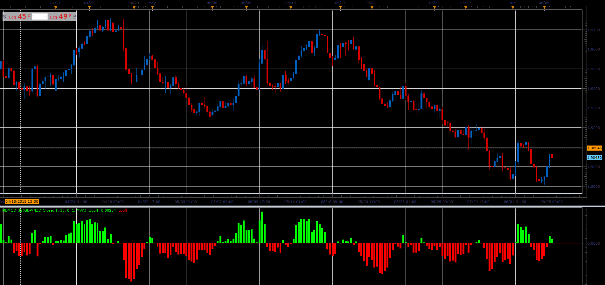

# MBMCD oscillator

> Source: https://fxcodebase.com/code/viewtopic.php?f=48&t=66440  
> Forum: 48 · Topic 66440 · 1 post(s)

---

## MBMCD oscillator

**Alexander.Gettinger** · Mon Aug 06, 2018 2:03 pm

Download:

 [MBMCD_JS.jsl](files/120372/MBMCD_JS.jsl)

For this indicator must be installed Averages indicator ([viewtopic.php?f=17&t=2430](https://fxcodebase.com/code/viewtopic.php?f=17&t=2430)).
