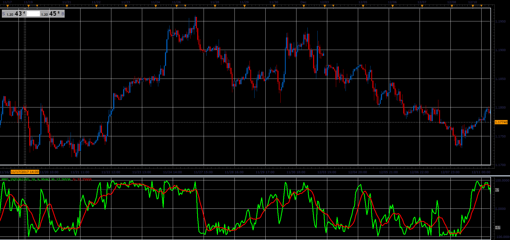

# Midpoint Oscillator

> Source: https://fxcodebase.com/code/viewtopic.php?f=48&t=65564  
> Forum: 48 · Topic 65564 · 1 post(s)

---

## Midpoint Oscillator

**Alexander.Gettinger** · Sat Jan 06, 2018 5:06 pm

As described in the Nov 1991 edition of S&C magazine.

%M=100* (2*Close-High(N)-Low(N))/(High(N)-Low(N)).

 

Download:

 [MPO_JS.jsl](files/116843/MPO_JS.jsl)
