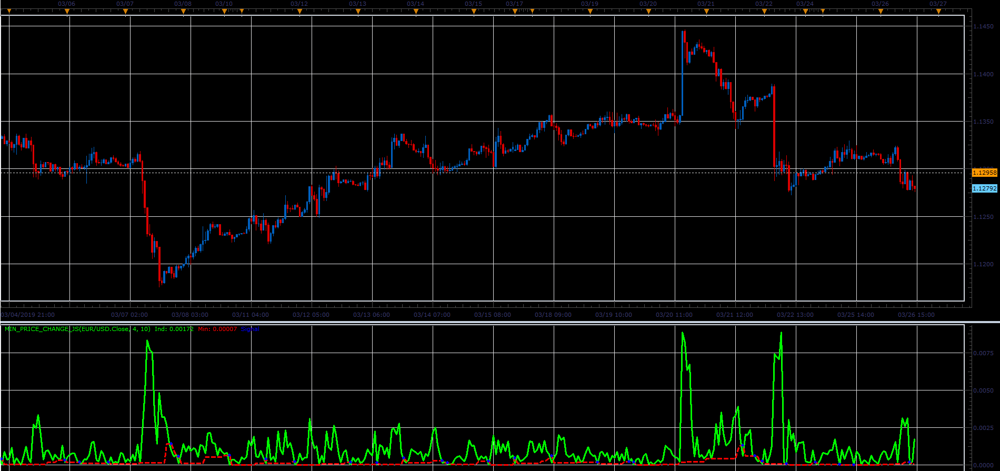

# Min price change oscillator

> Source: https://fxcodebase.com/code/viewtopic.php?f=48&t=68270  
> Forum: 48 · Topic 68270 · 1 post(s)

---

## Min price change oscillator

**Alexander.Gettinger** · Sat Mar 30, 2019 3:41 pm

Formulas:
Ind[i] = sum of Range from (i-ChangesPeriod+1) to i, where
Range[i] = Price[i]-Price[i-1].
Min[i] - minimum value of Ind from (i-CheckPeriod) to (i-1).

 

Download:

 [Min_Price_Change_JS.jsl](files/125490/Min_Price_Change_JS.jsl)
