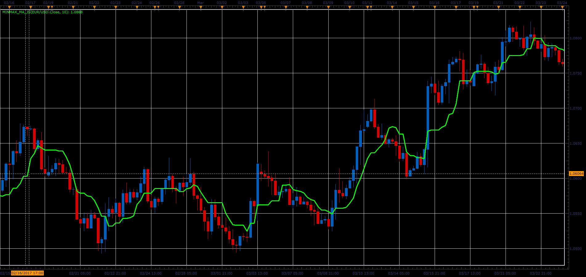

# Minimum-maximum moving average

> Source: https://fxcodebase.com/code/viewtopic.php?f=48&t=64730  
> Forum: 48 · Topic 64730 · 1 post(s)

---

## Minimum-maximum moving average

**Alexander.Gettinger** · Fri Jun 02, 2017 2:17 pm

Formula:
MinMaxMA[i]=(Min+Max)/2, where
Min, Max - minimum and maximum prices in range from (i-Period+1) to (i).

 

Download:

 [MinMax_MA_JS.jsl](files/112719/MinMax_MA_JS.jsl)
