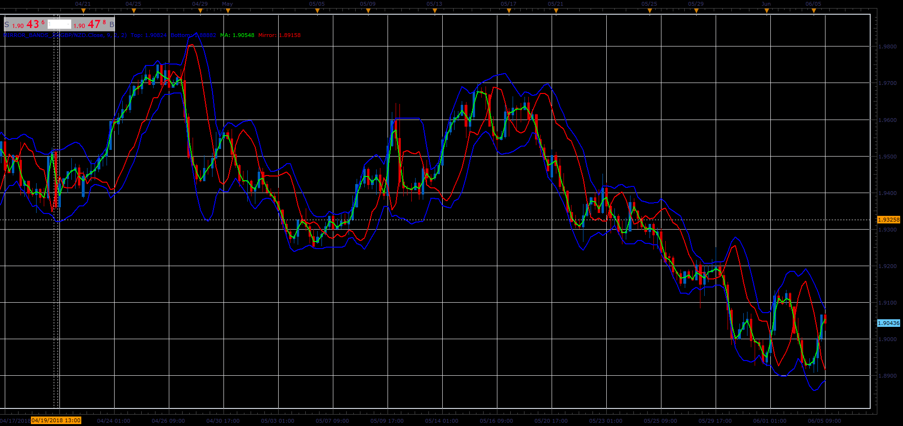

# Mirror Bands

> Source: https://fxcodebase.com/code/viewtopic.php?f=48&t=66442  
> Forum: 48 · Topic 66442 · 1 post(s)

---

## Mirror Bands

**Alexander.Gettinger** · Mon Aug 06, 2018 2:09 pm

Formulas:
Top[i] = Simple Moving average (Price, Length) + Dev,
Bottom[i] = Simple Moving average (Price, Length) - Dev,
MA[i] = Simple moving average (Price, MA_Length),
Mirror[i] = 2*Simple Moving average (Price, Length) - MA[i], where
Dev = Deviation*Sqrt(Sum/Length),
Sum - sum(Price[pos-i]-Simple Moving average (Price, Length)).

 

Download:

 [Mirror_Bands_JS.jsl](files/120374/Mirror_Bands_JS.jsl)
