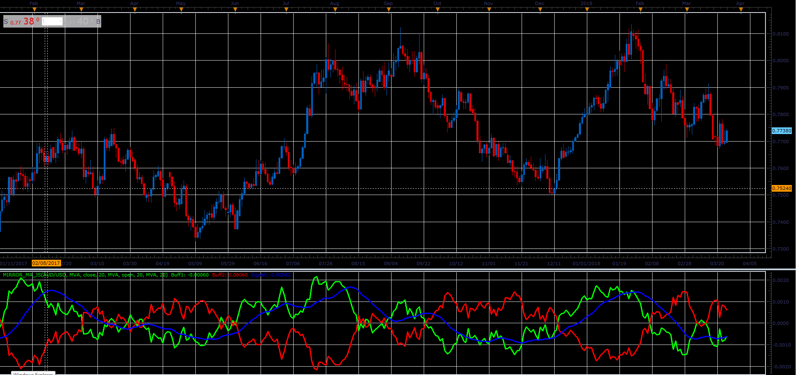
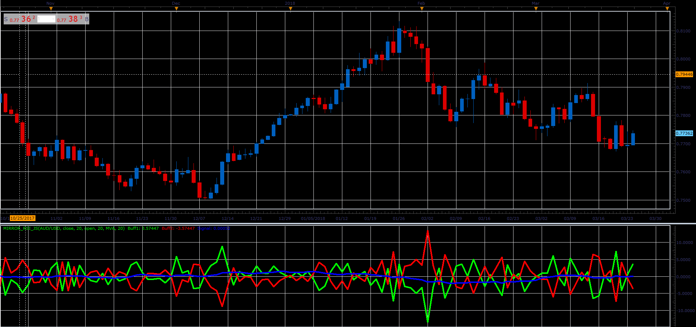

# Mirror MA indicator

> Source: https://fxcodebase.com/code/viewtopic.php?f=48&t=66051  
> Forum: 48 · Topic 66051 · 2 post(s)

---

## Mirror MA indicator

**Alexander.Gettinger** · Wed May 02, 2018 11:50 am

Formulas:
Line1=MA1[Method1, Price1, Period1] - MA2[Method2,Price2, Period2],
Line2=-Line1.

 

Download:

 [Mirror_MA_JS.jsl](files/119002/Mirror_MA_JS.jsl)

---

## Re: Mirror MA indicator

**Alexander.Gettinger** · Wed May 02, 2018 11:52 am

**Mirror RSI:**

 

Download:

 [Mirror_RSI_JS.jsl](files/119003/Mirror_RSI_JS.jsl)
