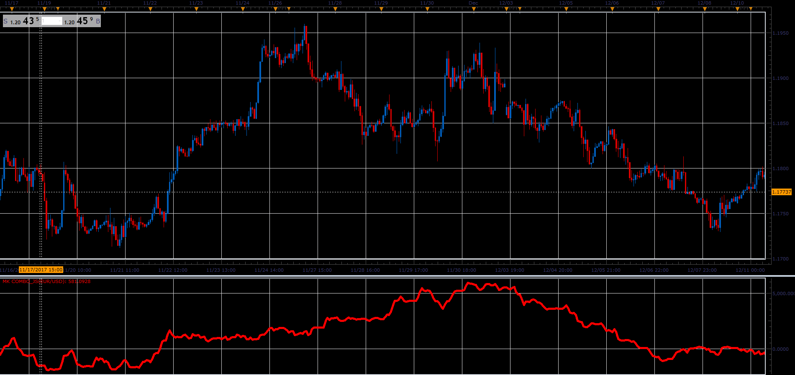

# MK combo

> Source: https://fxcodebase.com/code/viewtopic.php?f=48&t=65562  
> Forum: 48 · Topic 65562 · 1 post(s)

---

## MK combo

**Alexander.Gettinger** · Sat Jan 06, 2018 5:03 pm

MK combo= MK combo + (SSD.K - SSD.D)*(TBS.K - TBS.D)

 

Download:

 [MK Combo_JS.jsl](files/116841/MK%20Combo_JS.jsl)

You can find Tick Based Stochastic here: [viewtopic.php?f=17&t=9566](https://fxcodebase.com/code/viewtopic.php?f=17&t=9566)
