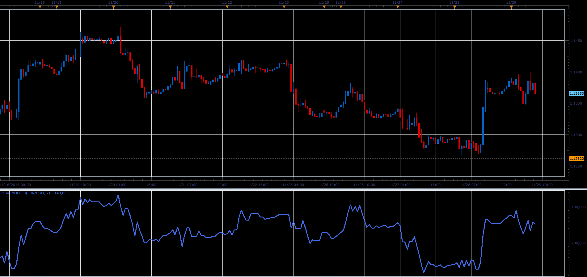

# Modified On Balance Volume

> Source: https://fxcodebase.com/code/viewtopic.php?f=48&t=67106  
> Forum: 48 · Topic 67106 · 1 post(s)

---

## Modified On Balance Volume

**Alexander.Gettinger** · Fri Dec 07, 2018 3:01 pm

Formula:
OBV = OBVprevious + VOLUME IF close > closeprevious+Gate
OBV = OBVprevious - VOLUME IF close < closeprevious-Gate
OBV = OBVprevious IF close = closeprevious

If Gate=0, the indicator equivalent to the initial On Balance Volume.

 

Download:

 [obv_mod_JS.jsl](files/122617/obv_mod_JS.jsl)
