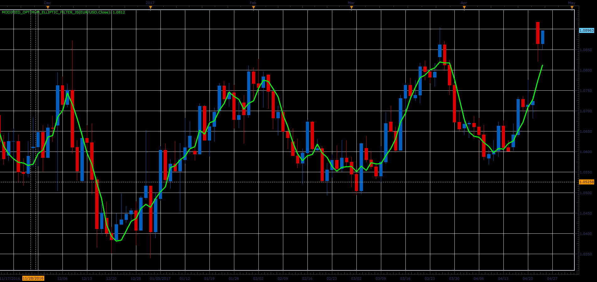

# Modified Optimum Elliptic Filter indicator

> Source: https://fxcodebase.com/code/viewtopic.php?f=48&t=64733  
> Forum: 48 · Topic 64733 · 1 post(s)

---

## Modified Optimum Elliptic Filter indicator

**Alexander.Gettinger** · Fri Jun 02, 2017 2:22 pm

The indicator uses modified elliptic filter from John Ehlers book "Cybernetic Analysis for Stocks and Futures: Cutting-Edge DSP Technology to Improve Your Trading".

 

Download:

 [Modified_Optimum_Elliptic_Filter_JS.jsl](files/112722/Modified_Optimum_Elliptic_Filter_JS.jsl)
