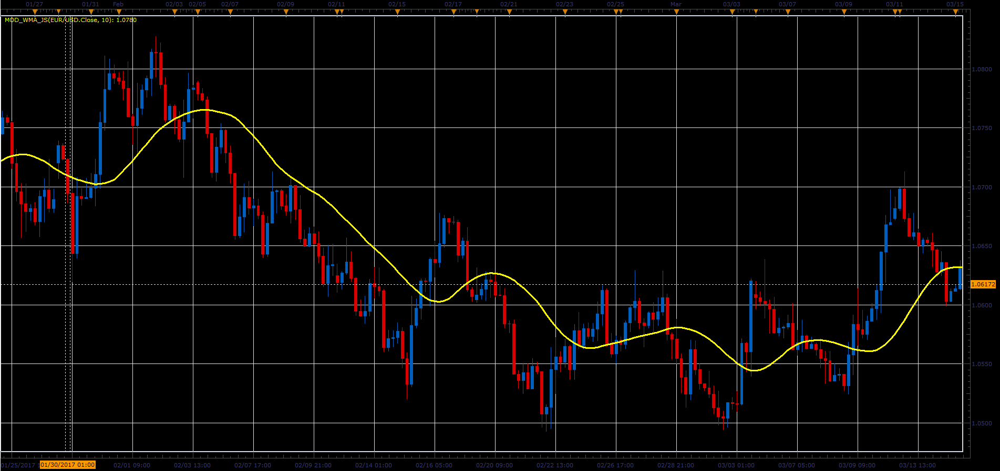

# Modified Wilders smooting average indicator

> Source: https://fxcodebase.com/code/viewtopic.php?f=48&t=64732  
> Forum: 48 · Topic 64732 · 1 post(s)

---

## Modified Wilders smooting average indicator

**Alexander.Gettinger** · Fri Jun 02, 2017 2:20 pm

Formula:
ModWMA[i] = (MVA(i) - ModWMA[i-1])*k + ModWMA[i-1], where
k = 1/Length.

 

Download:

 [Mod_WMA_JS.jsl](files/112721/Mod_WMA_JS.jsl)
