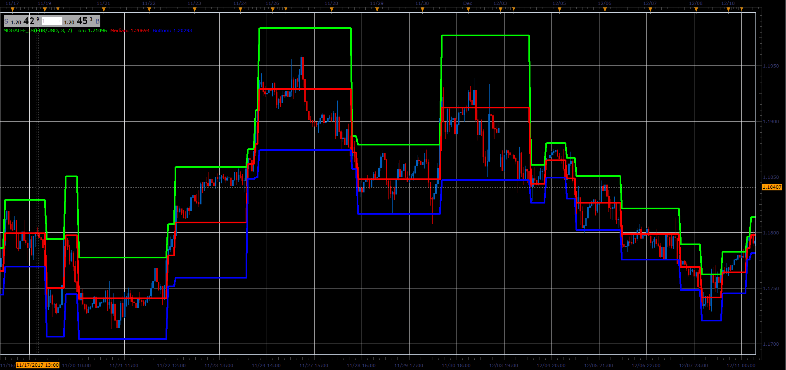

# Mogalef Bands

> Source: https://fxcodebase.com/code/viewtopic.php?f=48&t=65563  
> Forum: 48 · Topic 65563 · 1 post(s)

---

## Mogalef Bands

**Alexander.Gettinger** · Sat Jan 06, 2018 5:05 pm

Median = LinearReg((Open+High+Low+(2*Close))/5);
Deviation = StandardDev(Median);

Top Band = Median + Multiplier*Deviation;
Bottom Band = Median -Multiplier*Deviation;

 

Download:

 [Mogalef_JS.jsl](files/116842/Mogalef_JS.jsl)
