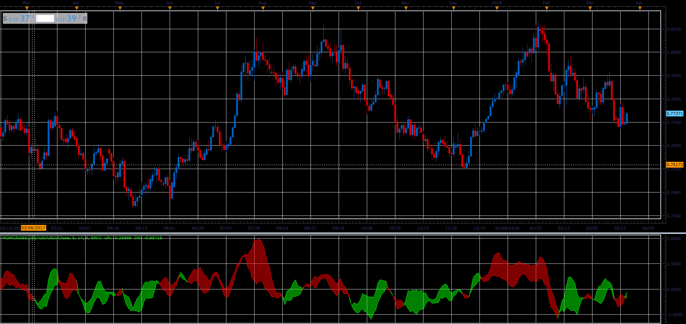

# Momentum cross oscillator

> Source: https://fxcodebase.com/code/viewtopic.php?f=48&t=66054  
> Forum: 48 · Topic 66054 · 1 post(s)

---

## Momentum cross oscillator

**Alexander.Gettinger** · Wed May 02, 2018 11:55 am

The oscillator is based on crossing of two momentums.

 

Download:

 [MomCross_JS.jsl](files/119006/MomCross_JS.jsl)

For this oscillator must be installed Averages indicator ([viewtopic.php?f=17&t=2430](https://fxcodebase.com/code/viewtopic.php?f=17&t=2430)).
