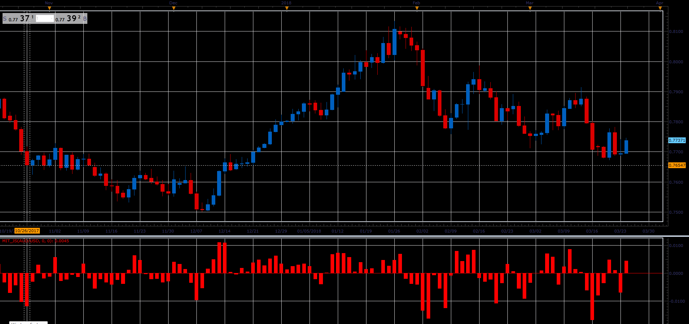

# Momentum In Time

> Source: https://fxcodebase.com/code/viewtopic.php?f=48&t=66052  
> Forum: 48 · Topic 66052 · 1 post(s)

---

## Momentum In Time

**Alexander.Gettinger** · Wed May 02, 2018 11:53 am

It behaves like an ordinary momentum.
There is one key difference.
Regular momemtum
Price Momentum = [Now] - Price [N periods ago]
Momentum in Time
Momentum In Time = Price [Now] - Price [During Selected Time]
Selected Time is Momemtum origin, anchorage for the entire trading day.

 

Download:

 [MIT_JS.jsl](files/119004/MIT_JS.jsl)
