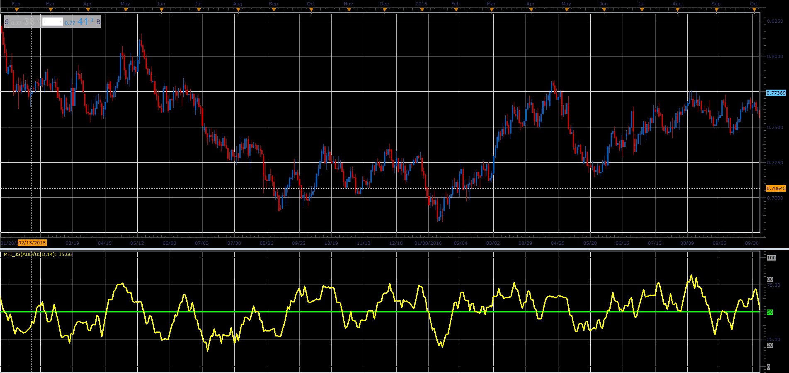

# Money Flow Index (MFI)

> Source: https://fxcodebase.com/code/viewtopic.php?f=48&t=66050  
> Forum: 48 · Topic 66050 · 1 post(s)

---

## Money Flow Index (MFI)

**Alexander.Gettinger** · Wed May 02, 2018 11:50 am

MFI is a momentum indicator, similar to RSI (Relative Strength Index), but it's more rigid because it is volume-weighted, and, therefore, is a good method to measure of the strength of money flowing in and out of a security. As RSI, the MFI scale is 0 - 100 and the indicator is often calculated using a 14 day period.

Formula:
Typical Price is (High + Low + Close) / 3

Positive = Typical * Volume IF Typical > Typical[previous]
Negative = Typical * Volume IF Typical < Typical[previous]
R(N) = Sum(Positive, N) / Sum(Negative, N)
MFI(N) = 100 - (100 / (1 + R(N))

 

Download:

 [mfi_JS.jsl](files/119001/mfi_JS.jsl)
