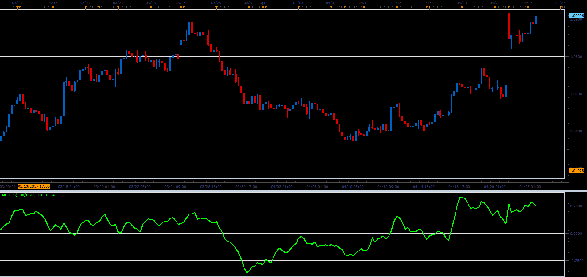

# Money Flow oscillator

> Source: https://fxcodebase.com/code/viewtopic.php?f=48&t=64727  
> Forum: 48 · Topic 64727 · 1 post(s)

---

## Money Flow oscillator

**Alexander.Gettinger** · Fri Jun 02, 2017 2:12 pm

This indicator has been described in the Stock&Commodities (October 2015).

Formula:
MFO = Sum(MFV)/Sum(Volume) with [Period] number of periods, where
MFV = Multiplier*Volume,
Multiplier[i] = [(High[i]-Low[i-1])-(High[i-1]-Low[i])]/[(High[i]-Low[i-1])+(High[i-1]-Low[i])].

 

Download:

 [MFO_JS.jsl](files/112716/MFO_JS.jsl)
