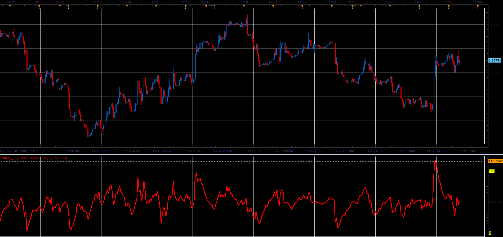

# Moving Average Envelopes Percentage (MAE%)

> Source: https://fxcodebase.com/code/viewtopic.php?f=48&t=67094  
> Forum: 48 · Topic 67094 · 1 post(s)

---

## Moving Average Envelopes Percentage (MAE%)

**Alexander.Gettinger** · Fri Dec 07, 2018 2:43 pm

The oscillator shows Prices as percentage of MAE channels.
Formula:
MAE[i] = 100*(Price[i]-dn)/(up-dn), where
up = MA*(1+Offset/1000),
dn = MA*(1-Offset/1000),
MA - MVA(Price) with [Length] number of periods.

 

Download:

 [MAE%_JS.jsl](files/122605/MAE_JS.jsl)
