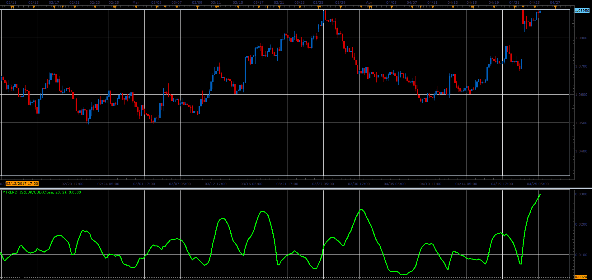

# Mtrend oscillator

> Source: https://fxcodebase.com/code/viewtopic.php?f=48&t=64734  
> Forum: 48 · Topic 64734 · 1 post(s)

---

## Mtrend oscillator

**Alexander.Gettinger** · Fri Jun 02, 2017 2:25 pm

Formula:
Mtrend = 2*StdDev*Deviation, where
StdDev - standard deviation with [Period] number of periods.

 

Download:

 [Mtrend_JS.jsl](files/112723/Mtrend_JS.jsl)
