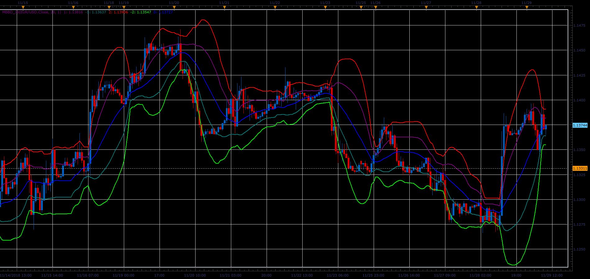

# Multiple Bollinger Bands Deviation Lines

> Source: https://fxcodebase.com/code/viewtopic.php?f=48&t=67095  
> Forum: 48 · Topic 67095 · 1 post(s)

---

## Multiple Bollinger Bands Deviation Lines

**Alexander.Gettinger** · Fri Dec 07, 2018 2:45 pm

Formulas:
U1 = MA+d,
L1 = MA-d,
U2 = MA+2*d,
L2 = MA-2*d,
U3 = MA+3*d,
L3 = MA-3*d,
U4 = MA+4*d,
L4 = MA-4*d, where
MA - moving average with [Length] number of periods and [Method] type,
d = Deviation*StdDev,
StdDev - standard deviation.

 

Download:

 [MBBD_JS.jsl](files/122606/MBBD_JS.jsl)
