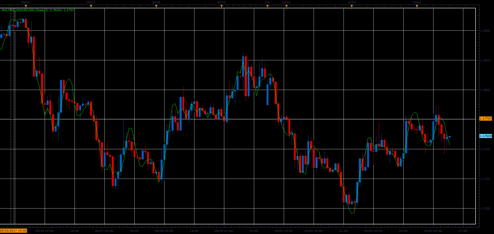

# Multiple Moving Average

> Source: https://fxcodebase.com/code/viewtopic.php?f=48&t=65233  
> Forum: 48 · Topic 65233 · 1 post(s)

---

## Multiple Moving Average

**Alexander.Gettinger** · Sat Oct 28, 2017 9:42 am

This indicator is a development of double and triple moving averages;

if Mode=1 Indicator = MA (MVA, EMA, ...)
if Mode=2 Indicator = Double MA
if Mode=3 Indicator = Triple MA.

 

Download:

 [MultMA_JS.jsl](files/115657/MultMA_JS.jsl)
