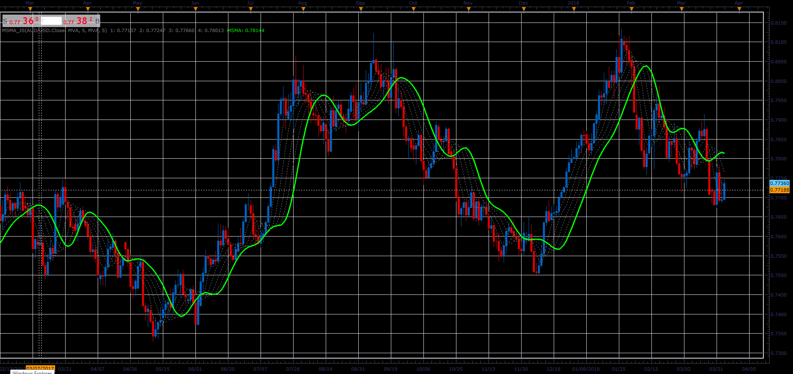

# Multiple smoothing moving Average

> Source: https://fxcodebase.com/code/viewtopic.php?f=48&t=66055  
> Forum: 48 · Topic 66055 · 1 post(s)

---

## Multiple smoothing moving Average

**Alexander.Gettinger** · Wed May 02, 2018 11:57 am

The indicator allows multiple smoothing the initial data.
The user can choose the period and method of moving average,
Number of repetitions.
Each successive repetitions, using the data of previous step.

 

Download:

 [MSMA_JS.jsl](files/119007/MSMA_JS.jsl)
