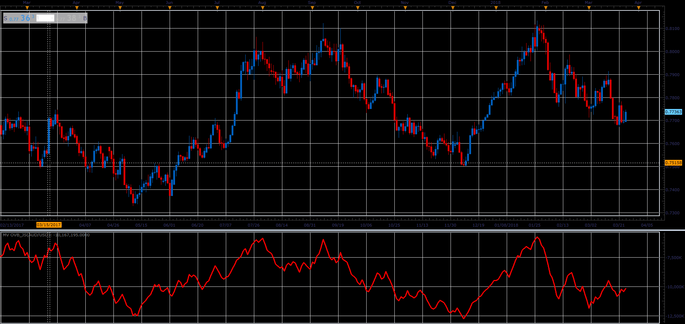

# MultiVote OBV

> Source: https://fxcodebase.com/code/viewtopic.php?f=48&t=66056  
> Forum: 48 · Topic 66056 · 1 post(s)

---

## MultiVote OBV

**Alexander.Gettinger** · Wed May 02, 2018 11:58 am

Original OBV only compares Closing Price.
MVOVB takes into account all price components.
This has resulted with higher sensitivity compared to the original.

if HIGH >previous HIGH then HIGHVOTE =1
if HIGH < previous HIGH then HIGHVOTE =-1

if LOW >previous LOW then LOWVOTE =1
if LOW < previous LOW then LOWVOTE =-1

if CLOSE>previous CLOSE then CLOSEVOTE=1
if CLOSE < previous CLOSE then CLOSEVOTE =-1

TOTALVOTE = HIGHVOTE + LOWVOTE + CLOSEVOTE
MVOBV = previousMVOBV + TOTALVOTE * Volume
MVOBV = previousMVOBV + TOTALVOTE * Volume

 

Download:

 [MV OVB_JS.jsl](files/119008/MV%20OVB_JS.jsl)
