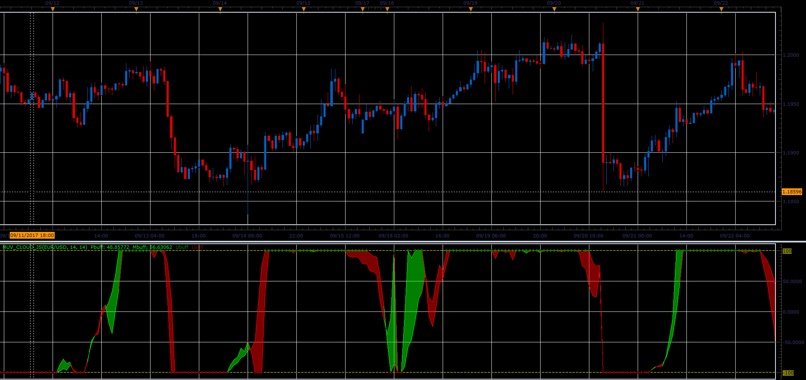

# MUV cloud oscillator

> Source: https://fxcodebase.com/code/viewtopic.php?f=48&t=65235  
> Forum: 48 · Topic 65235 · 1 post(s)

---

## MUV cloud oscillator

**Alexander.Gettinger** · Sat Oct 28, 2017 10:05 am

Download:

 [MUV_Cloud_JS.jsl](files/115659/MUV_Cloud_JS.jsl)

For this indicator must be installed Averages indicator ([viewtopic.php?f=17&t=2430](https://fxcodebase.com/code/viewtopic.php?f=17&t=2430)) and XMUV indicator ([viewtopic.php?f=17&t=36267](https://fxcodebase.com/code/viewtopic.php?f=17&t=36267)).
