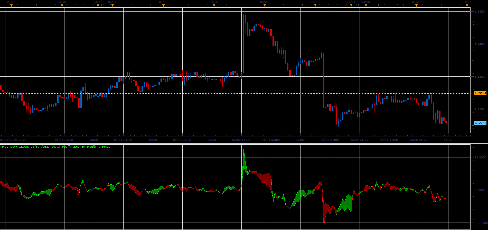
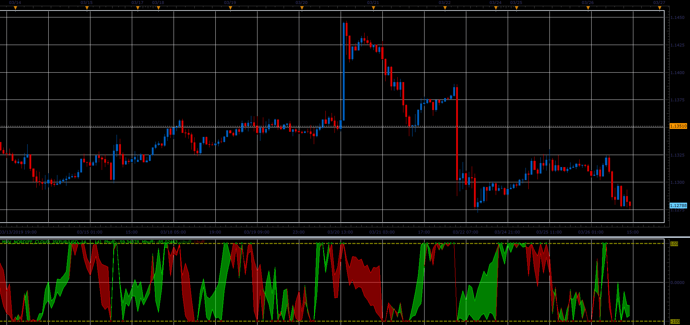

# MUV_DIFF cloud oscillator

> Source: https://fxcodebase.com/code/viewtopic.php?f=48&t=68272  
> Forum: 48 · Topic 68272 · 1 post(s)

---

## MUV_DIFF cloud oscillator

**Alexander.Gettinger** · Sat Mar 30, 2019 3:46 pm

The indicator of fast trends based on two movings.

 

Download:

 [MUV_DIFF_Cloud_JS.jsl](files/125492/MUV_DIFF_Cloud_JS.jsl)

 

Download:

 [MUV_NorDIFF_Cloud_JS.jsl](files/125492/MUV_NorDIFF_Cloud_JS.jsl)

For this indicator must be installed Averages indicator ([viewtopic.php?f=17&t=2430](https://fxcodebase.com/code/viewtopic.php?f=17&t=2430)).
