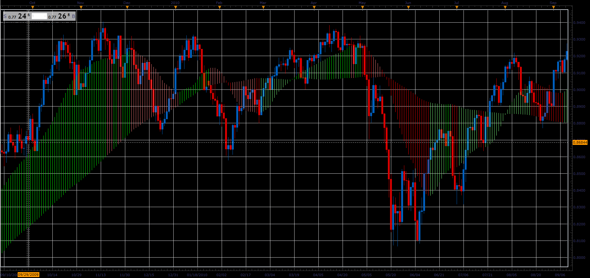

# MVA/EMA Cloud

> Source: https://fxcodebase.com/code/viewtopic.php?f=48&t=65928  
> Forum: 48 · Topic 65928 · 1 post(s)

---

## MVA/EMA Cloud

**Alexander.Gettinger** · Thu Apr 12, 2018 12:00 pm

The relationship between moving average determines the color of the clouds.
We distinguish 4 cases.
Short & Long Growing
Growing Short & Long Falling
Falling Short & Long Growing
Short & Long Falling

 

Download:

 [Cloud_JS.jsl](files/118642/Cloud_JS.jsl)
