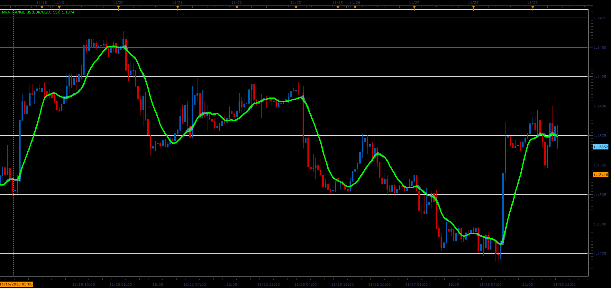

# MVA Range indicator

> Source: https://fxcodebase.com/code/viewtopic.php?f=48&t=67103  
> Forum: 48 · Topic 67103 · 1 post(s)

---

## MVA Range indicator

**Alexander.Gettinger** · Fri Dec 07, 2018 2:56 pm

The indicator shows the range in which changed the MVA (simple moving average) during the each bar.

Formulas:
MVA[i]=Sum[i]/Period, where
Sum[i]=sum close prices in the range from (i-Period+1) to (i),
Top of cloud=(Sum-Close+High)/Period and
Bottom of cloud=(Sum-Close+Low)/Period.

 

Download:

 [MVA_Range_JS.jsl](files/122614/MVA_Range_JS.jsl)
