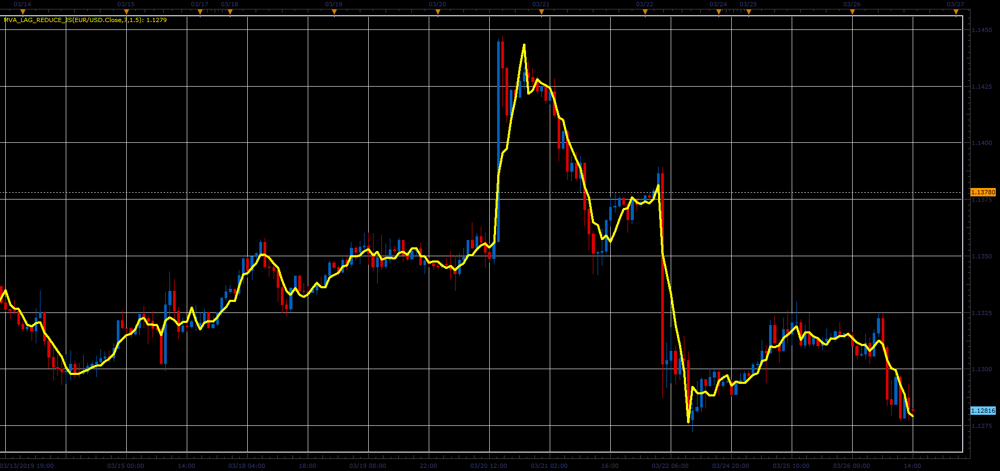

# MVA with Lag Reducing

> Source: https://fxcodebase.com/code/viewtopic.php?f=48&t=68236  
> Forum: 48 · Topic 68236 · 1 post(s)

---

## MVA with Lag Reducing

**Alexander.Gettinger** · Sat Mar 30, 2019 2:37 pm

Formula:
MLR[i] = ((MVA[i]/MVA[i-1])^RL_Factor)*MVA[i], where
MVA - simple moving average with [Length] number of periods.

 

Download:

 [MVA_lag_reduce_JS.jsl](files/125455/MVA_lag_reduce_JS.jsl)
