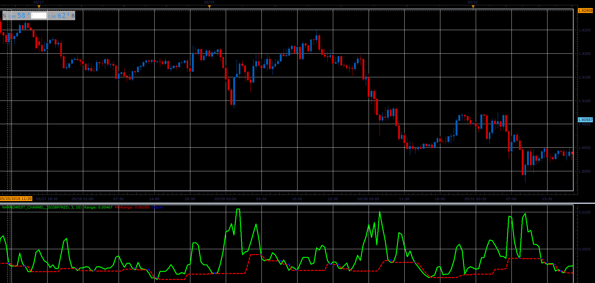

# Narrowest Channel

> Source: https://fxcodebase.com/code/viewtopic.php?f=48&t=66551  
> Forum: 48 · Topic 66551 · 1 post(s)

---

## Narrowest Channel

**Alexander.Gettinger** · Sat Aug 18, 2018 9:26 pm

Formulas:
Range[i] = Max-Min, where
Max, min - maximum and minimum prices from (i-Range+1) to i.
MinRange[i] - minimum value of Range from (i-Period) to (i-1).

 

Download:

 [Narrowest_Channel_JS.jsl](files/120654/Narrowest_Channel_JS.jsl)
