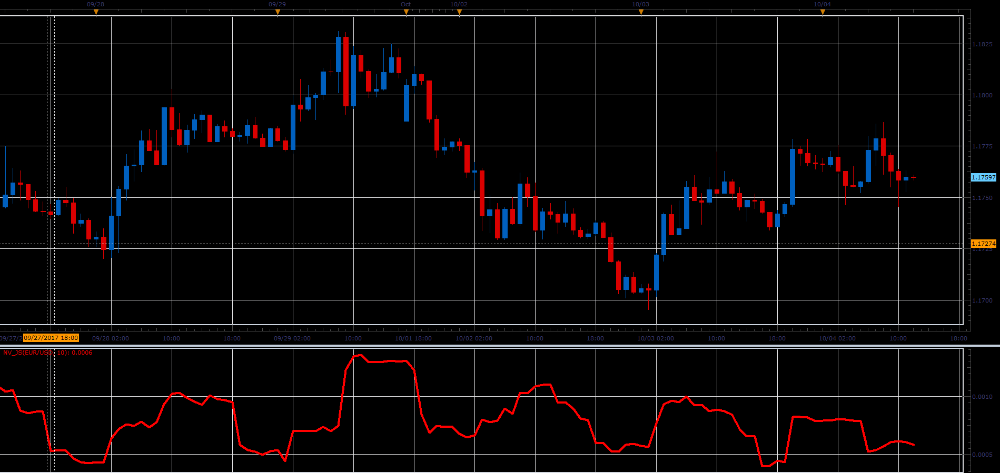

# Natenberg's Volatility

> Source: https://fxcodebase.com/code/viewtopic.php?f=48&t=65238  
> Forum: 48 · Topic 65238 · 1 post(s)

---

## Natenberg's Volatility

**Alexander.Gettinger** · Sat Oct 28, 2017 10:09 am

Historical volatility is defined by Sheldon Natenberg, as the standard deviation of the logarithmic price changes measured at regular intervals of time.

 

Download:

 [NV_JS.jsl](files/115662/NV_JS.jsl)
