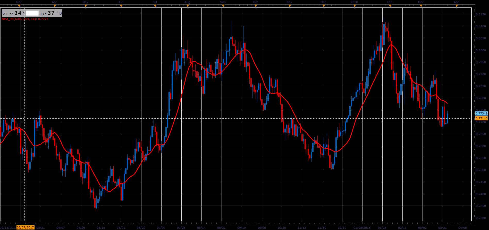

# Navel MA

> Source: https://fxcodebase.com/code/viewtopic.php?f=48&t=66058  
> Forum: 48 · Topic 66058 · 1 post(s)

---

## Navel MA

**Alexander.Gettinger** · Wed May 02, 2018 12:00 pm

Formula:
NMA = MA(P) with [Length] number of periods and [Method] type, where
P = (5*Close+2*Open+High+Low)/9.

 

Download:

 [NMA_JS.jsl](files/119010/NMA_JS.jsl)
