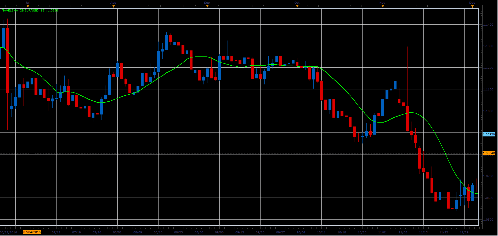

# Navel SMA

> Source: https://fxcodebase.com/code/viewtopic.php?f=48&t=64735  
> Forum: 48 · Topic 64735 · 1 post(s)

---

## Navel SMA

**Alexander.Gettinger** · Fri Jun 02, 2017 2:28 pm

Formula:
NavelSMA = MVA((5*Close+2*Open+High+Low)/9) .

 

Download:

 [NavelSMA_JS.jsl](files/112724/NavelSMA_JS.jsl)
