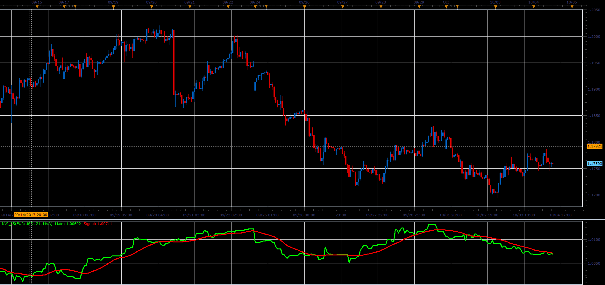

# Negative Volume Index

> Source: https://fxcodebase.com/code/viewtopic.php?f=48&t=65239  
> Forum: 48 · Topic 65239 · 1 post(s)

---

## Negative Volume Index

**Alexander.Gettinger** · Sat Oct 28, 2017 10:11 am

Download:

 [NVI_JS.jsl](files/115663/NVI_JS.jsl)

For this indicator must be installed Averages indicator from [viewtopic.php?f=17&t=2430](https://fxcodebase.com/code/viewtopic.php?f=17&t=2430)
