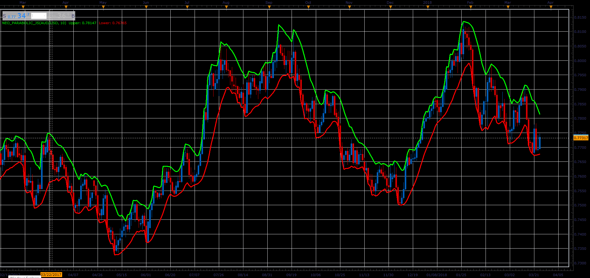

# Neoparabolic indicator

> Source: https://fxcodebase.com/code/viewtopic.php?f=48&t=66057  
> Forum: 48 · Topic 66057 · 1 post(s)

---

## Neoparabolic indicator

**Alexander.Gettinger** · Wed May 02, 2018 11:59 am

Formulas:
Upper[i] = Max[i]/Period,
Lower[i] = Min[i]/Period, where
Min[i] = Sum of lowest prices at range from (i-Period+1) to (i),
Max[i] = Sum of highest prices at range from (i-Period+1) to (i).

 

Download:

 [Neo_Parabolic_JS.jsl](files/119009/Neo_Parabolic_JS.jsl)
