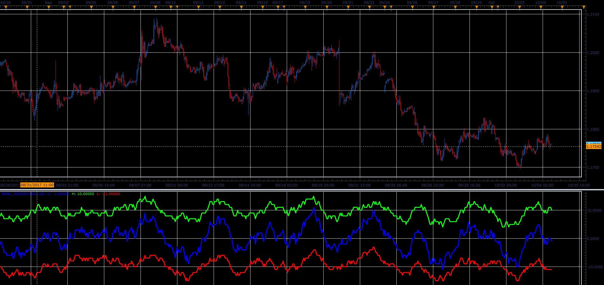

# New Highs New Lows Index

> Source: https://fxcodebase.com/code/viewtopic.php?f=48&t=65236  
> Forum: 48 · Topic 65236 · 1 post(s)

---

## New Highs New Lows Index

**Alexander.Gettinger** · Sat Oct 28, 2017 10:07 am

Index is calculated as the difference between,
number of higher highs in the period, and,
number of lower lows in the period.

 

Download:

 [NHNL_JS.jsl](files/115660/NHNL_JS.jsl)
