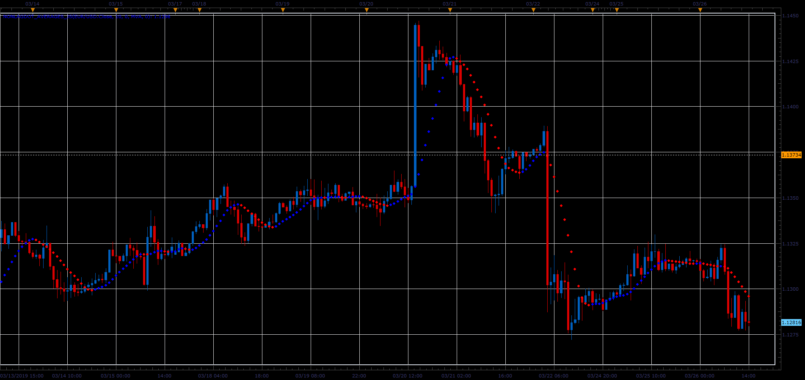
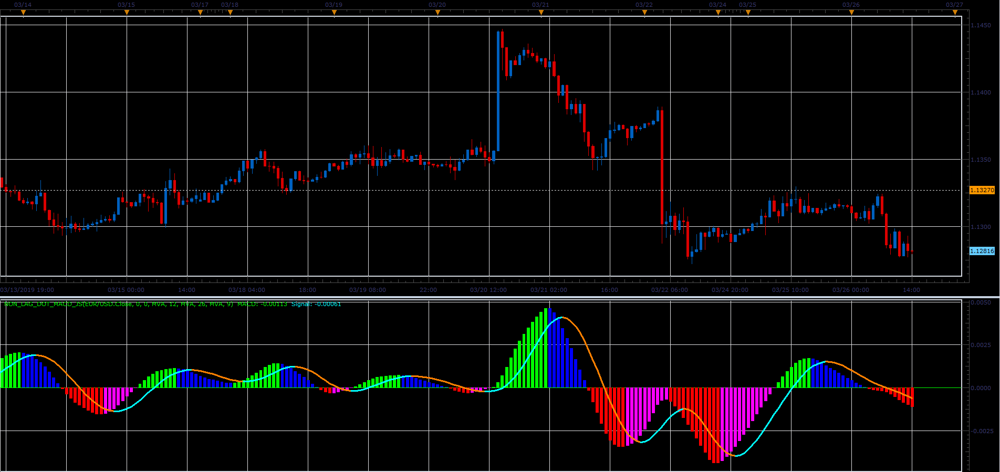

# Non lag average indicator and non lag MACD

> Source: https://fxcodebase.com/code/viewtopic.php?f=48&t=68237  
> Forum: 48 · Topic 68237 · 1 post(s)

---

## Non lag average indicator and non lag MACD

**Alexander.Gettinger** · Sat Mar 30, 2019 2:40 pm

**NonLag averages:**

 

Download:

 [Nonlagdot_Averages_JS.jsl](files/125456/Nonlagdot_Averages_JS.jsl)

**NonLag MACD:**

 

Download:

 [Non_Lag_Dot_MACD_JS.jsl](files/125456/Non_Lag_Dot_MACD_JS.jsl)

For this indicators must be installed Averages indicator ([viewtopic.php?f=17&t=2430](https://fxcodebase.com/code/viewtopic.php?f=17&t=2430)).
