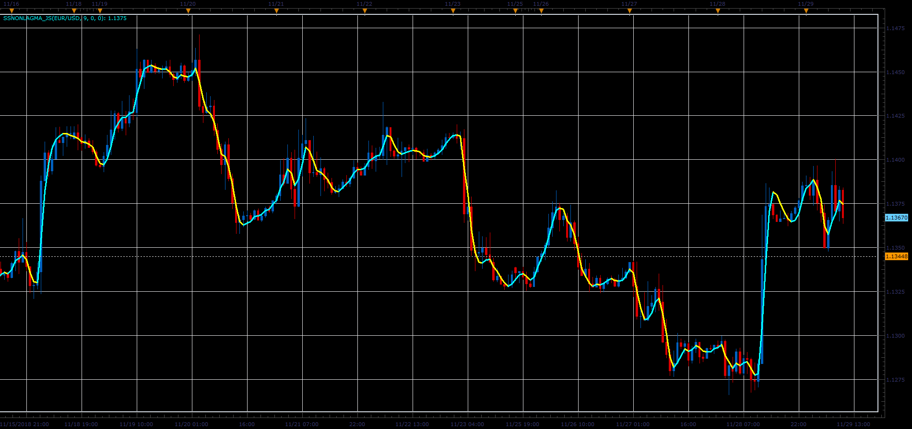

# Non-Lag Moving Average

> Source: https://fxcodebase.com/code/viewtopic.php?f=48&t=67111  
> Forum: 48 · Topic 67111 · 1 post(s)

---

## Non-Lag Moving Average

**Alexander.Gettinger** · Fri Dec 07, 2018 3:10 pm

Download:

 [SSNonLagMA_JS.jsl](files/122622/SSNonLagMA_JS.jsl)
