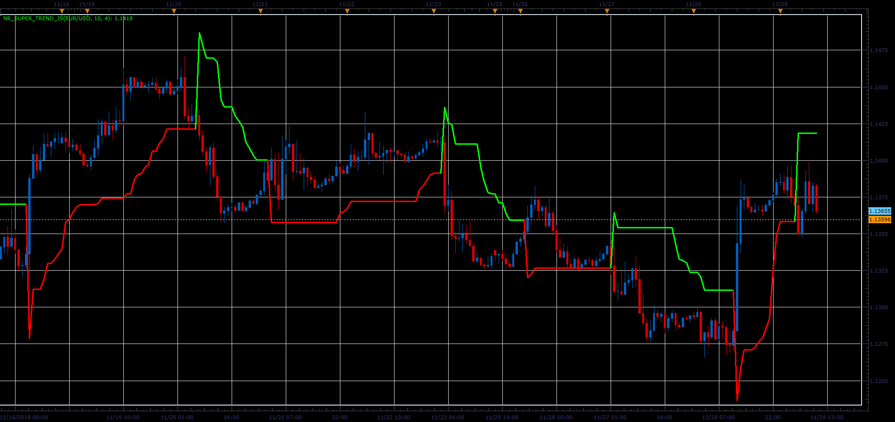

# Non Repainting Supertrend Indicator

> Source: https://fxcodebase.com/code/viewtopic.php?f=48&t=67105  
> Forum: 48 · Topic 67105 · 3 post(s)

---

## Non Repainting Supertrend Indicator

**Alexander.Gettinger** · Fri Dec 07, 2018 2:59 pm

Formulas:
Up branch = Median price + Mulriplier*ATR(Period),
Dn branch = Median price + Mulriplier*ATR(Period).

 

Download:

 [NR_Super_Trend_JS.jsl](files/122616/NR_Super_Trend_JS.jsl)

---

## Re: Non Repainting Supertrend Indicator

**logicgate** · Tue Jan 22, 2019 5:04 pm

Can you compile a MT4 version please?

---

## Re: Non Repainting Supertrend Indicator

**Apprentice** · Tue Jan 29, 2019 5:02 pm

Try this version.
[viewtopic.php?f=38&t=65458](https://fxcodebase.com/code/viewtopic.php?f=38&t=65458)
