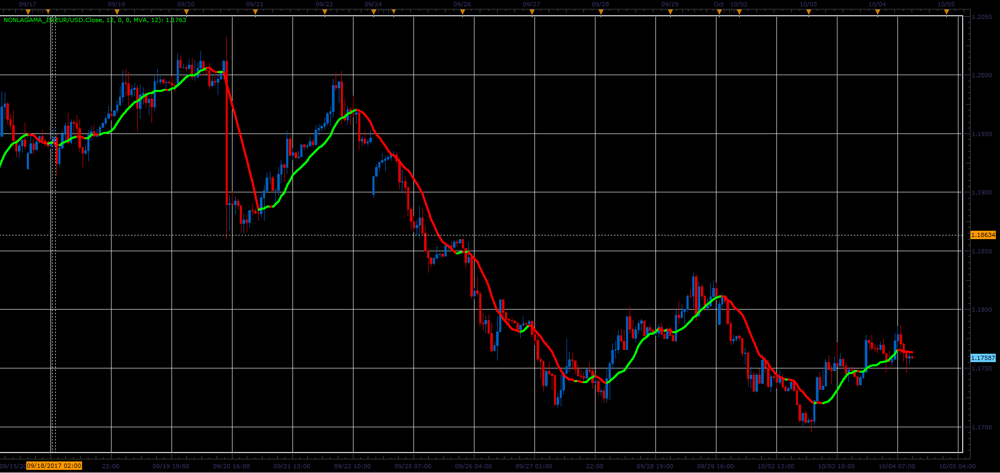

# NonLagAMA indicator

> Source: https://fxcodebase.com/code/viewtopic.php?f=48&t=65237  
> Forum: 48 · Topic 65237 · 1 post(s)

---

## NonLagAMA indicator

**Alexander.Gettinger** · Sat Oct 28, 2017 10:08 am

Download:

 [NonLagAMA_JS.jsl](files/115661/NonLagAMA_JS.jsl)
