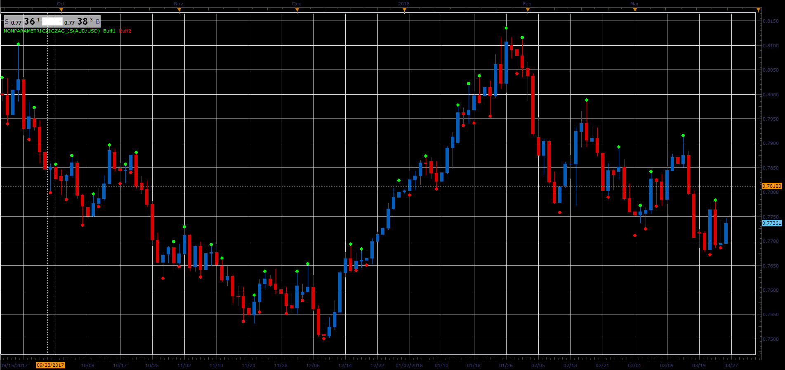

# Nonparametric zigzag

> Source: https://fxcodebase.com/code/viewtopic.php?f=48&t=66060  
> Forum: 48 · Topic 66060 · 1 post(s)

---

## Nonparametric zigzag

**Alexander.Gettinger** · Wed May 02, 2018 12:03 pm

Nonparametric zigzag. The monotonicity condition for the ascending segment of the zigzag: the High of any subsequent bar must not be lower than any Low of the ascending segment. Similarly, for the descending segments of the zigzag.

 

Download:

 [NonparametricZigZag_JS.jsl](files/119012/NonparametricZigZag_JS.jsl)
