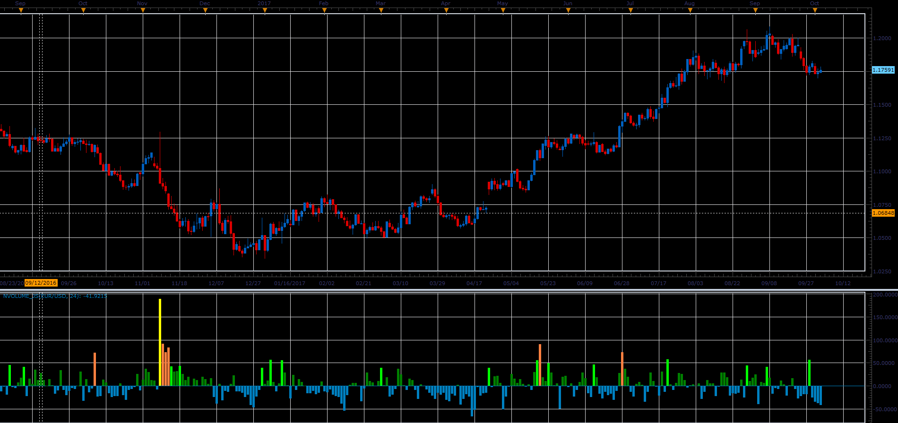

# Normalized volume

> Source: https://fxcodebase.com/code/viewtopic.php?f=48&t=65240  
> Forum: 48 · Topic 65240 · 1 post(s)

---

## Normalized volume

**Alexander.Gettinger** · Sat Oct 28, 2017 10:13 am

The blue color indicates that the current volume is less than the average one for the period;
The dark green color indicates a little increase of volume compared to the average one for the period;
The light green color indicates that increase of volume overcame Fibo level of 38.2% compared to the average one for the period;
The orange color indicates that increase of volume overcame Fibo level of 61,8% compared to the average one for the period;
The yellow color indicates that increase of volume overcame Fibo level of 100% compared to the average one for the period;

 

Download:

 [NVolume_JS.jsl](files/115664/NVolume_JS.jsl)
