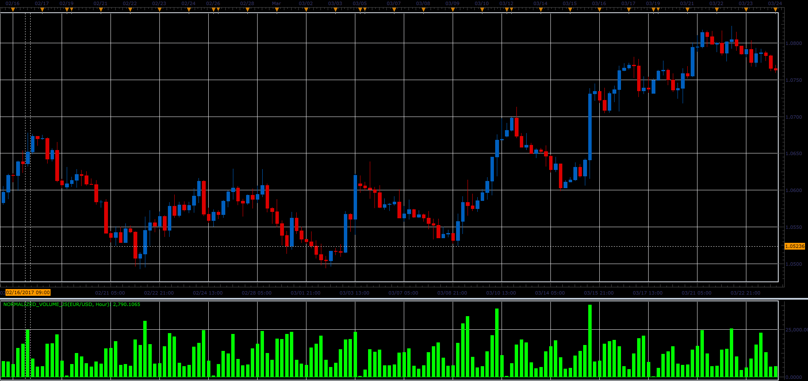

# Normalized volume

> Source: https://fxcodebase.com/code/viewtopic.php?f=48&t=64738  
> Forum: 48 · Topic 64738 · 1 post(s)

---

## Normalized volume

**Alexander.Gettinger** · Mon Jun 05, 2017 11:10 am

The indicator normalizes the volume by time (number of ticks per minute, per hour, per day).

 

Download:

 [Normalized_Volume_JS.jsl](files/112749/Normalized_Volume_JS.jsl)
