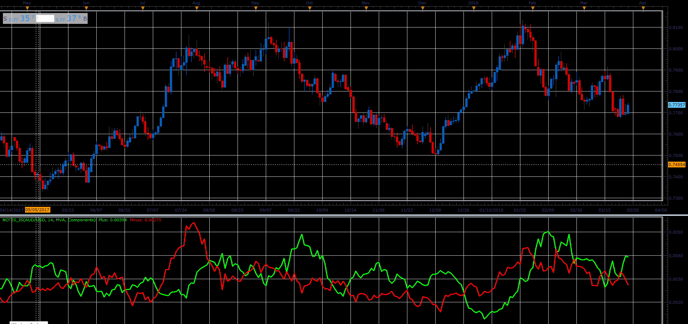

# NOTIS% V

> Source: https://fxcodebase.com/code/viewtopic.php?f=48&t=66061  
> Forum: 48 · Topic 66061 · 1 post(s)

---

## NOTIS% V

**Alexander.Gettinger** · Wed May 02, 2018 12:04 pm

Formula:
NOTIS[i] = 100*Plus[i]/(Plus[i]+Minus[i]), where
Plus = Moving Average(P, Length, Method),
Minus = Moving average(M, Length, Method),
P[i] = High[i]-Close[i],
M[i] = Close[i]-Low[i].

 

Download:

 [NOTIS_JS.jsl](files/119013/NOTIS_JS.jsl)
