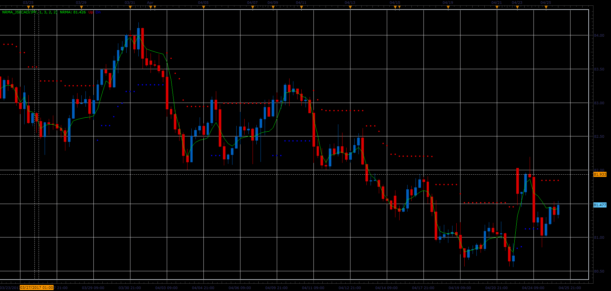

# NRMA indicator

> Source: https://fxcodebase.com/code/viewtopic.php?f=48&t=64798  
> Forum: 48 · Topic 64798 · 1 post(s)

---

## NRMA indicator

**Alexander.Gettinger** · Wed Jun 14, 2017 11:37 am

NRMA is the indicator by Konstantin Kopyrkin, it produced numerous realizations of the indicator NRTR. In this variant we see a moving average (line) and trailing stops NRTR (points).

 

Download:

 [NRMA_JS.jsl](files/112891/NRMA_JS.jsl)
