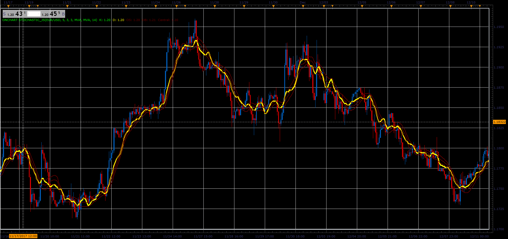

# OnChart Stochastic

> Source: https://fxcodebase.com/code/viewtopic.php?f=48&t=65565  
> Forum: 48 · Topic 65565 · 1 post(s)

---

## OnChart Stochastic

**Alexander.Gettinger** · Sat Jan 06, 2018 5:07 pm

Formulas:
Central[i] = Moving average(ATR_Length, K_Smooth_Method, Close, i),
OB[i] = Central[i]+ATR*(Overbought_Level-50)/100,
OS[i] = Central[i]-ATR*(Oversold_Level-50)/100,
K[i] = Central[i]+(StochK-50)*ATR/100,
D[i] = Central[i]+(StochD-50)*ATR/100, where
ATR - ATR(ATR_Length),
StochK, StochD - K and D lines of Stochastic(K_Length, D_Length, Slowing_Length, K_Smooth_Method).

 

Download:

 [OnChart Stochastic_JS.jsl](files/116844/OnChart%20Stochastic_JS.jsl)
