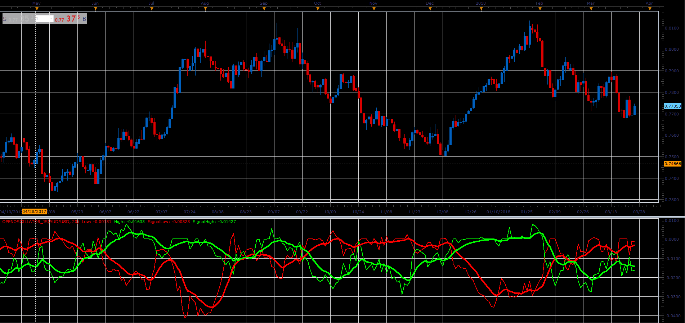

# Open oscillator

> Source: https://fxcodebase.com/code/viewtopic.php?f=48&t=66062  
> Forum: 48 · Topic 66062 · 1 post(s)

---

## Open oscillator

**Alexander.Gettinger** · Wed May 02, 2018 12:05 pm

Formulas:
Low[i]=Open[MinPos]-Open[i],
High[i]=Open[i]-Open[MaxPos], where
MinPos is a position of minimum Low price in range from (i-Period) to (i),
MaxPos is a position of maximum High price in range from (i-Period) to (i).

Also oscillator have a 2 signal line (EMA with [SignalPeriod]).

 

Download:

 [OpenOscillator_JS.jsl](files/119014/OpenOscillator_JS.jsl)
