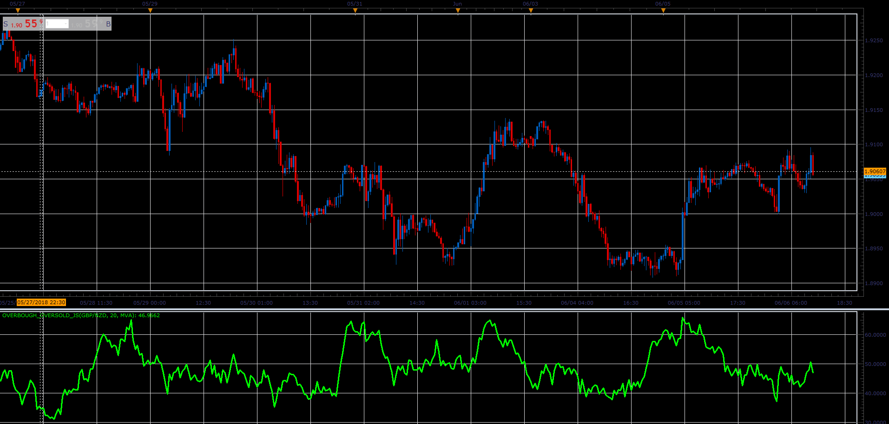

# Overbough Oversold oscillator

> Source: https://fxcodebase.com/code/viewtopic.php?f=48&t=66552  
> Forum: 48 · Topic 66552 · 1 post(s)

---

## Overbough Oversold oscillator

**Alexander.Gettinger** · Sat Aug 18, 2018 9:27 pm

Formula:
Overbought_Oversold=(MA/ATR)*100, where
MA - moving average for (Close-Low) with Length as period,
ATR - average true range with Length as period.

 

Download:

 [Overbough_Oversold_JS.jsl](files/120655/Overbough_Oversold_JS.jsl)
